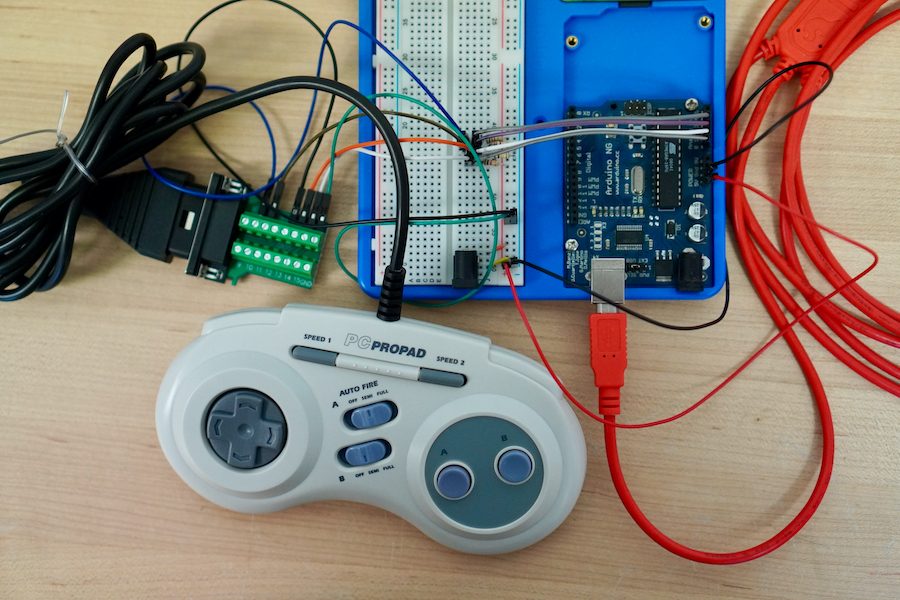

# Gameport Controller



## Parts

 - Performance(TM) PC Propad Model SV-230
 - [Arduino](https://www.arduino.cc) Board and software (any model)
 - Breadboard
 - USB cable for Arduino to controller computer
 - Male-to-male jumper wires [Buy at Sparkfun](https://www.sparkfun.com/products/8431)
 - Resistors
    - 2 x 100 kΩ
    - 2 x 10 kΩ
 - DB15 Breakout Connector [Buy on Amazon](https://www.amazon.com/dp/B07JNSSTGC/ref=cm_sw_r_tw_dp_x_X.OdFbFWD1J7Y)
 - [Processing Software](https://processing.org)

## Tools

 - Screwdriver

## Installation

### Circuit

### Arduino

Create a symbolic link in the Arduino application's "sketch" folder to the code in this project.

```
[~/Documents/Arduino/sketches]# ln -s {{path_to_this_repo}}/code/arduino pc_controller
```

### Processing

Create a symbolic link in the Arduino application's "sketch" folder to the code in this project.

```
[~/Documents/Processing/v3]# ln -s {{path_to_this_repo}}/code/processing pc_controller
```

## References

 - [Game port on Wikipedia](https://en.wikipedia.org/wiki/Game_port)
